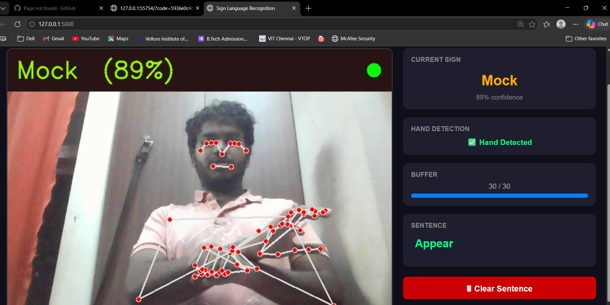
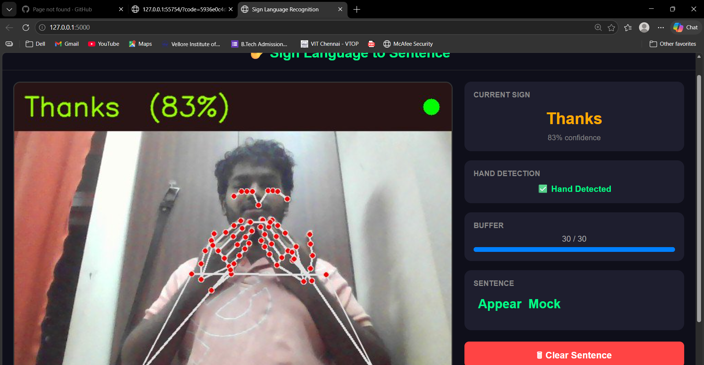
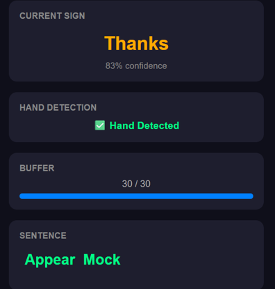

# Sign Language Recognition System

A real-time sign language recognition system that converts hand signs into text sentences using MediaPipe keypoints and an LSTM deep learning model.

##  Demo

The system detects hand signs from a webcam feed, recognizes them using a trained LSTM model, and builds sentences word by word in real time.

##  How It Works

1. **MediaPipe Holistic** extracts 1662 keypoints per frame (pose + face + both hands)
2. **30 frames** are collected into a sequence buffer
3. The **LSTM model** predicts the sign from the keypoint sequence
4. Predictions are smoothed using a **majority vote** over 7 frames
5. When the hand is lowered, the recognized word is added to the sentence

##  Dataset

- **LSA64** — 64 Argentine Sign Language classes, 50 sequences per class
- Videos converted to MediaPipe keypoint `.npy` files for training

##  Project Structure

```
sign-language-recognition/
├── flask_app.py              # Main web app (Flask)
├── app.py                    # Streamlit version
├── sign_language_kp_model.h5 # Trained LSTM model
├── lsa64_labels.npy          # Class label mappings
├── labels.txt                # Sign number to word mapping
└── README.md
```

## Model Architecture

```
LSTM(128, return_sequences=True, activation='tanh')
Dropout(0.3)
LSTM(64, return_sequences=False, activation='tanh')
Dropout(0.3)
Dense(64, activation='relu')
Dropout(0.2)
Dense(64, activation='softmax')
```

- Input shape: `(30, 1662)`
- Output: 64 classes
- Optimizer: Adam (lr=1e-3)
- Loss: Categorical Crossentropy

##  Requirements

```
tensorflow==2.13.0
mediapipe==0.10.13
opencv-python
flask
scikit-learn
numpy==1.24.3
protobuf==4.25.9
tqdm
```

##  Installation

### 1. Create virtual environment
```bash
python -m venv sign_env
sign_env\Scripts\activate
```

### 2. Install dependencies
```bash
pip install tensorflow==2.13.0 mediapipe==0.10.13 opencv-python flask scikit-learn numpy==1.24.3 protobuf==4.25.9 tqdm ipykernel
```

### 3. Run the Flask app
```bash
python flask_app.py
```

Open your browser at `http://localhost:5000`

##  Training Pipeline

### Step A — Extract keypoints from LSA64 videos
Run the keypoint extraction notebook cell — processes all videos and saves `.npy` files to `MP_Data/`

### Step B — Train the LSTM model
Run the training notebook cell — trains on extracted keypoints with class balancing and early stopping

### Step C — Real-time inference
Run `flask_app.py` for the web interface or use the Jupyter webcam cell for direct inference

##  Features

-  Real-time webcam sign recognition
-  Skeleton overlay on video feed
-  Confidence score display
-  Sentence building word by word
-  Works under different lighting conditions (keypoint-based)
-  64 LSA64 sign classes supported
-  Flask web interface

##  Key Design Decisions

| Decision | Reason |
|---|---|
| MediaPipe keypoints instead of raw pixels | Invariant to lighting, background, skin tone |
| LSTM with tanh activation | Better gradient flow than ReLU for sequences |
| 30-frame sequences | Captures full sign motion |
| Majority vote smoothing | Eliminates flickering predictions |
| Confidence threshold 0.80 | Prevents false predictions during transitions |
| Class weights during training | Handles minor class imbalance |

##  Results

- Model trained on 64 classes with ~45-50 sequences per class
- Real-time inference at full webcam frame rate
- Stable predictions with majority vote over 7 frames

## Demo

### Recognizing "Thanks" (83% confidence)


### Recognizing "Mock" (89% confidence)  


### Sentence Building


##  LSA64 Sign Classes

| Number | Sign | Number | Sign |
|---|---|---|---|
| 001 | Opaque | 033 | Hungry |
| 002 | Red | 034 | Map |
| 003 | Green | 035 | Coin |
| 004 | Yellow | 036 | Music |
| 005 | Bright | 037 | Ship |
| 006 | Light-blue | 038 | None |
| 007 | Colors | 039 | Name |
| 008 | Pink | 040 | Patience |
| 009 | Women | 041 | Perfume |
| 010 | Enemy | 042 | Deaf |
| 011 | Son | 043 | Trap |
| 012 | Man | 044 | Rice |
| 013 | Away | 045 | Barbecue |
| 014 | Drawer | 046 | Candy |
| 015 | Born | 047 | Chewing-gum |
| 016 | Learn | 048 | Spaghetti |
| 017 | Call | 049 | Yogurt |
| 018 | Skimmer | 050 | Accept |
| 019 | Bitter | 051 | Thanks |
| 020 | Sweet milk | 052 | Shut down |
| 021 | Milk | 053 | Appear |
| 022 | Water | 054 | To land |
| 023 | Food | 055 | Catch |
| 024 | Argentina | 056 | Help |
| 025 | Uruguay | 057 | Dance |
| 026 | Country | 058 | Bathe |
| 027 | Last name | 059 | Buy |
| 028 | Where | 060 | Copy |
| 029 | Mock | 061 | Run |
| 030 | Birthday | 062 | Realize |
| 031 | Breakfast | 063 | Give |
| 032 | Photo | 064 | Find |

## 🙏 Acknowledgements

- [LSA64 Dataset](http://facundoq.github.io/datasets/lsa64/) — Argentine Sign Language dataset
- [MediaPipe](https://mediapipe.dev/) — Hand and pose landmark detection
- [TensorFlow](https://www.tensorflow.org/) — Deep learning framework
